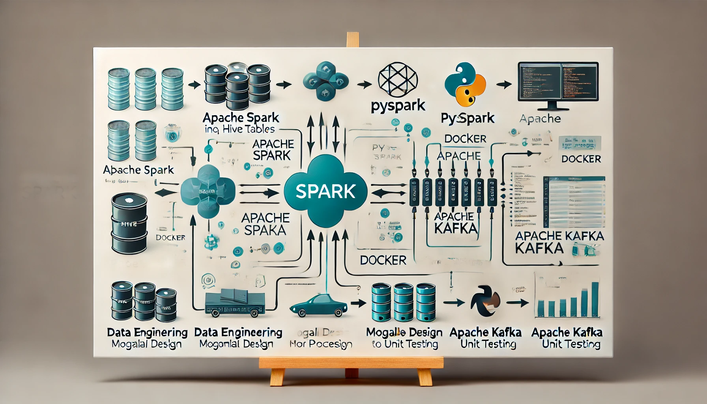

# Spark Bulk Data Loader Project



## Table of Contents
- [Project Overview](#project-overview)
- [Technologies Used](#technologies-used)
- [Architecture](#architecture)
- [Installation](#installation)
- [Usage](#usage)
- [Features](#features)
- [Best Practices](#best-practices)
- [Contributing](#contributing)
- [License](#license)
- [Contact](#contact)

## Project Overview

This project showcases the capabilities of Apache Spark and PySpark, demonstrating how to process entity data from Hive tables and publish the results to a Kafka topic. It is designed with best practices in mind, focusing on modular design and unit testing.

### Goals
- Read and process data from Hive.
- Transform and prepare data according to specific requirements.
- Publish the processed data to a Kafka topic for real-time data streaming.

## Technologies Used

- **Apache Spark** (v3.4.3)
- **PySpark**
- **Spark SQL**
- **Docker** (for containerization)
- **Apache Kafka** (for data streaming)
- **Hive** (for data storage)
- **Python** (for scripting)
- **Unit Testing Frameworks** (e.g., Pytest)

## Architecture

  <!-- Replace with your architecture diagram path -->

This project employs a microservices architecture using Docker containers for isolated environments. The data flow is as follows:

1. **Data Ingestion**: Data is read from Hive tables.
2. **Data Processing**: Spark processes and transforms the data.
3. **Data Output**: Processed data is sent to a Kafka topic for further consumption.

## Installation

To set up the project locally, follow these steps:

1. **Clone the Repository**
   ```bash
   git clone https://github.com/etemadhoseini/Spark-Bulk-Data-Loader.git
   cd Spark-Bulk-Data-Loader
   ```

2. **Set Up Docker Environment**
   Ensure you have Docker installed. Run the following command to build the Docker image:
   ```bash
   docker-compose up --build
   ```

3. **Start Services**
   The necessary services (Spark, Kafka, Hive) will start automatically. Make sure they are running properly.

## Usage

To run the Spark job inside the spark master, use the following command:

```bash
python main.py lacal 2024-10-01
```

## Features

- **Modular Design**: The project is organized into reusable components for easy maintenance.
- **Unit Testing**: Unit tests are included to ensure code reliability and performance.
- **Scalability**: Designed to handle large datasets efficiently using Spark's distributed computing capabilities.

## Best Practices

- **Code Organization**: Follow a modular structure for better maintainability.
- **Documentation**: Ensure all functions and classes are well-documented.
- **Testing**: Write unit tests for all major components.
- **Version Control**: Use Git for version control and maintain a clean commit history.

## Contributing

Contributions are welcome! Please follow these steps:

1. Fork the repository.
2. Create a new branch (`git checkout -b feature/YourFeature`).
3. Commit your changes (`git commit -m 'Add new feature'`).
4. Push to the branch (`git push origin feature/YourFeature`).
5. Open a pull request.

## License

This project is licensed under the MIT License. See the [LICENSE](assets/LICENCE) file for more details.

## Contact

For any inquiries, please reach out to:

- **Amir Hosein Etemad Hoseini**: [etemadhoseini@gmail.com](mailto:etemadhoseini@gmail.com)
- **LinkedIn**: [Your LinkedIn Profile](https://www.linkedin.com/in/etemadhoseini/)

---

**Happy coding! 🎉**
